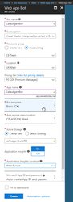

# Heading

This article introduces the Live Assist for *Microsoft Dynamics 365* **Bot as an Enabler Bot C# SDK**, running within the Azure Web App Bot Framework.

The examples contained here do not provide a detailed guide for developing bots within the Microsoft Azure framework. We assume that the developer has experience of C# and the Microsoft Azure Framework, and that they are able to use this quick start guide as a starting point to become familar with the Live Assist SDK.

**Note:** The Microsoft Web App Bot Framework is currently in development. You may need to make some changes in the steps, or the code, for your development effort. We recommend that you develop your application using Microsoft Visual Studio Professional—do *not* use the App Service Editor provided in the Azure web interface.

See also: [BotBuilder samples repository](https://github.com/Microsoft/BotBuilder-Samples)

### Step 1—Creating a C# basic Web App bot
1. In Azure, create a new **C# Web App Bot**.
1. Set the appropriate **Storage** and **Billing** requirements for your application.

   The significant parts of this process are:  
    
   * Selecting a name which is unique within Azure
   * Selecting the C# (Basic) Application
   
     
    
   This process may take Azure a few minutes to build.  
    
### Step 4—Developing your application
Based on the Microsoft **SimpleEchoBot** sample bot, make the following changes to the **EchoDialog.cs** file:

1. Managing Imports
   The following packages are required:  
    ```csharp
    using Microsoft.Bot.Builder.ConnectorEx;
    using Newtonsoft.Json;
    using System.Timers;
    using Cafex.LiveAssist.Bot;
    ```
1. More Complex Code
```csharp
        async void OnTimedEvent(Object source, ElapsedEventArgs eea)
        {
            if (chatContext != null)
            {
                // Create an upstream reply
                var reply = JsonConvert.DeserializeObject<ConversationReference>(conversationRef)
                    .GetPostToBotMessage().CreateReply();

                // Create upstream connection on which to send reply 
                var client = new ConnectorClient(new Uri(reply.ServiceUrl));

                // Poll Live Assist for events
                var chatInfo = await sdk.Poll(chatContext);

                if (chatInfo != null)
                {
                    // ChatInfo.ChatEvents will contain events since last call to poll.
                    if (chatInfo.ChatEvents != null && chatInfo.ChatEvents.Count > 0)
                    {
                        foreach (ChatEvent e in chatInfo.ChatEvents)
                        {
                            switch (e.Type)
                            {
                                // type is either "state" or "line".
                                case "line":
                                    // Source is either: "system", "agent" or "visitor"
                                    if (e.Source.Equals("system"))
                                    {
                                        reply.From.Name = "system";
                                    }
                                    else if (e.Source.Equals("agent"))
                                    {
                                        reply.From.Name = chatInfo.AgentName;

                                    }
                                    else
                                    {
                                        break;
                                    }

                                    reply.Type = "message";
                                    reply.Text = e.Text;
                                    client.Conversations.ReplyToActivity(reply);
                                    break;

                                case "state":
                                    // State changes
                                    // Valid values: "waiting", "chatting", "ended"
                                    if (chatInfo.State.Equals("ended"))
                                    {
                                        chatContext = null;
                                    }
                                    break;
                            }
                        }
                    }
                }
            }
        }
```
